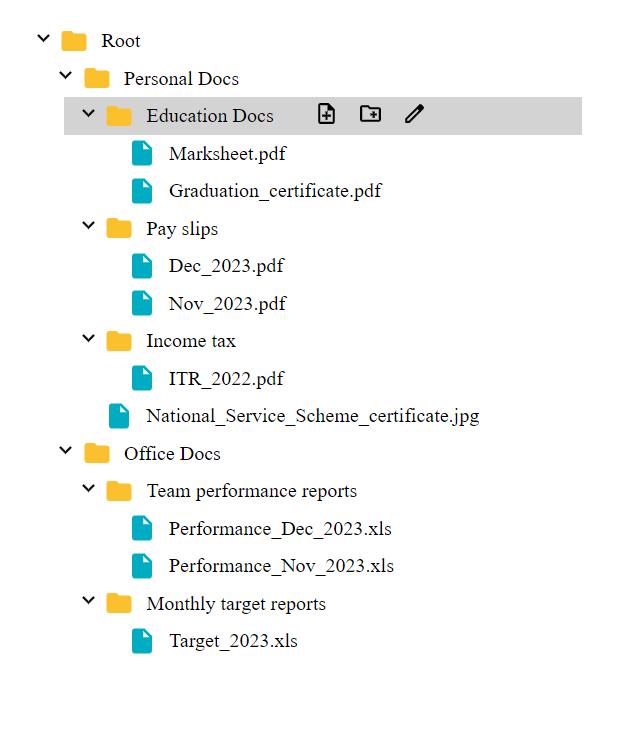

# Tree View File Explorer
This React application features a Tree View File Explorer, providing users with a hierarchical representation of files and folders. The application includes several key functionalities to facilitate file management.

## Functionalities

### 1. Create File
Users can create new files within the file explorer.
### 2. Create Folder
The application allows users to create new folders, organizing files hierarchically.
### 3. Rename File and Folder
Users can rename both files and folders, providing flexibility in managing the file structure.
### 4. Expand and Collapse Folder
The tree view supports expanding and collapsing folders, enabling users to navigate through the file hierarchy easily.

## Preview



## Installation

- Pull this branch into your local system.
- Make sure you have Node installed (preferrably Node v18.17.1).
- Navigate to the project directory and run 
  ```
  npm install
  ```
- Once all the dependencies have been installed, run the following command to start the dev server.
  ```
  npm run dev
  ```